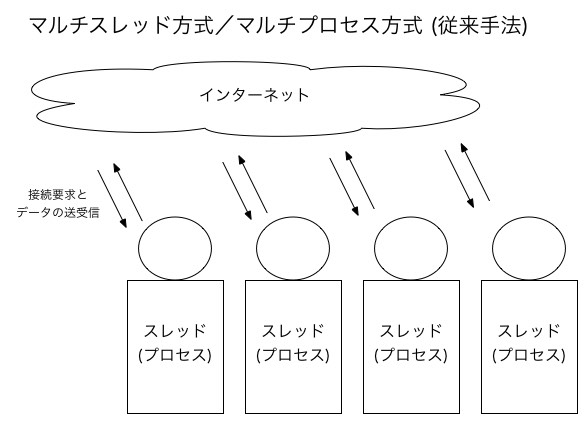
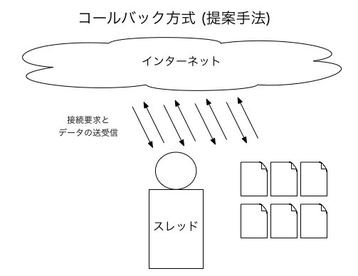

# Elixirの軽量コールバックスレッドの実装とPhoenixの同時セッション最大数・レイテンシ改善の構想
## 北九州市立大学 山崎 進
## デライトシステムズ 森 正和，上野 嘉大
## 京都大学 高瀬 英希

# Plan to Implementation of Lightweight Callback Thread for Elixir and Improvement of Maximum Concurrent Sessions and Latency of Phoenix
## Susumu Yamazaki (University of Kitakyushu)

Node.js\[1\]では，コールバックを用いてI/Oを非同期的に扱って擬似的にマルチタスクにする機構が備わっている\[2\]。我々はC++で同様の機構を実装し，Zackernel(ザッカーネル)として公開した\[3\]\[4\]。このような仕組みにより，ウェブサーバーがリクエストを受け付ける際に消費するメモリ量を大幅に削減でき，その結果，同時セッション最大数とレイテンシが改善される。そこで，我々はElixir\[5\]にこのような仕組み，**軽量コールバックスレッド(lightweight callback thread)**を実装することを着想した。これによりElixirベースのウェブサーバープラットフォームであるPhoenix\[6\]の同時セッション最大数とレイテンシが改善されることを期待している。

本発表では，先行して開発したZackernelの実装について紹介し，Elixirで軽量コールバックスレッドを実装する方針を提案する。次に軽量コールバックスレッドを，従来のマルチタスクの機構であるスケジューラスレッドと非同期スレッドプールとどのように統合していくか，メモリ管理機構との関係をどのように位置づけるかについての方針を提案する。さらにPhoenixで軽量コールバックスレッドをどのように活用するかの方針についても提案する。

今後，我々はElixirに軽量コールバックスレッドのプロトタイプを実装し，性能を評価して前述の提案の実現可能性について検討する。

## 1. はじめに

Apache\[7\]などの現状のウェブサーバーでは，図1に示すようにスレッドやプロセス，軽量プロセスなどを用いて同時に接続要求された複数のセッションを処理している。この方式ではセッションごとに数10MB程度のスタックメモリを消費するため，セッション数が極端に多くなると実メモリが不足してパフォーマンスが悪化し，その結果，同時セッション最大数が大きく制約され，レイテンシが悪化する。



図1: 従来のマルチスレッド/マルチプロセス方式

そこで，Node.js\[1\]では，コールバックを用いてI/Oを非同期的に扱って擬似的にマルチタスクにする機構が備わっている\[2\]。これによりNode.jsでは図2に示すように，1つのスレッドで複数のセッションを処理することができる。この結果，同時セッションが増えてもスタックメモリを消費せず，1つのセッションあたり数〜数百KB程度のタスク管理ブロック(TCB)を必要とする程度で済むため，セッション数が相当多くなっても耐えられるシステムを構築することができる。



図2: Node.jsのコールバック方式

Node.jsを記述しているプログラミング言語Javascriptでは，匿名関数を利用できる。Node.jsを用いると次のように匿名関数を用いて非同期I/Oの処理を記述することができる。なお，このコード例では Sleep-Async \[8\]を用いた。`sleep.sleep(1000)`で1000ミリ秒間スリープし，その後，`.then()`の中に記述された匿名関数を呼び出している。

```javascript
const sleep = require('sleep-async')().Promise;

const startTime = new Date().getTime();
console.log('startTime: ' + startTime);

sleep.sleep(1000)
  .then(() => new Date().getTime())
  .then(stopTime => {
  	console.log('stopTime: ' + stopTime);
  	console.log('Difference: '+((stopTime-startTime)/1000)+' [s]');
  });
```

我々は同様の機構を2016年にZackernelとしてC++に実装した\[3\]\[4\]。Zackernelで狙った領域は，RFIDのような極端に小規模で消費電力の少ないIoT用途である。

そこで我々はZackernelで得た経験を踏まえ，極端に大きな同時セッション接続数と高いレスポンス性能を要求されるクラウドサーバー用途として，このような用途に向くElixir\[5\]ベースで開発されたPhoenix\[6\]に同様の機構を適用できないかを検討する。

### 1.1 本発表の目的

本発表の目的は次の通りである。

* ElixirでNode.jsやZackernel同様のコールバックを用いた機構，**軽量コールバックスレッド**を実装する方針を検討する
* Phoenixで軽量コールバックスレッドをどのように活用するかについて検討する

### 1.2 本発表のアプローチ

本発表の目的を達成するために次のようなアプローチで研究を行う。

1. Zackernelの実装についてふりかえる
2. Elixirで軽量コールバックスレッドを実装する方針を提案する
3. 軽量コールバックスレッドを，従来のマルチタスクの機構とどのように統合するか方針を提案する
4. 軽量コールバックスレッドとメモリ管理機構との関係の位置付けの方針を提案する
5. 3,4を踏まえ，Phoenixで軽量コールバックスレッドをどのように活用するかの方針について提案する

### 1.3 この後の本発表の構成

この後，本発表を次のように構成する:

* 第2章でZackernelについてふりかえる。
* 第3章でElixirでの軽量コールバックスレッドの実装方針を提案する。
* 第4章でElixirの従来マルチタスク機構とどのように統合するかの方針を提案する。
* 第5章で軽量コールバックスレッドとメモリ管理機構との関係の位置付けの方針を提案する。
* 第6章でPhoenixで軽量コールバックスレッドをどのように活用するかの方針について提案する
* 第7章で本発表をまとめ，将来課題について述べる。

## 2. Zackernel

Zackernel\[2\]\[3\]は，C++11以降で採用された匿名関数を用い，Node.js\[1\]同様の機構を実装している。


## 3. Elixirでの軽量コールバックスレッドの実装方針

## 4. 従来マルチタスク機構との統合

## 5. 軽量コールバックスレッドとメモリ管理の関係

Elixirの従来マルチタスク機構の特徴は，軽量プロセスごとにGCなどのメモリ管理が独立している点である。これにより，軽量プロセスに不具合が生じた時に再起動してメモリごと再初期化することが可能になる。

一方，軽量コールバックスレッドを使っている場合は，原理上，一連の軽量コールバックスレッドでメモリ管理を共有することになる。したがって，1つの軽量コールバックスレッドに不具合が生じた場合に再起動すると，同時に起動していた軽量コールバックスレッド全てを道連れにしてしまうことに注意すべきである。

## 6. Phoenixにおける軽量コールバックスレッドの活用方針

現状のPhoenixでの接続要求の受付の流れは次のようになっている。

1. 1つの受付プロセスがポート待機している。
2. 受付プロセスが1つの接続要求を受理すると，1つのセッション処理プロセスを起動し，以降の接続処理をセッション処理プロセスに委ねて，次の接続要求をポート待機する。
3. セッション処理プロセスが，接続要求を処理するためにネットワークやデータベースにI/Oアクセスするが，その際にあらかじめ起動している複数の非同期スレッドにI/O処理を委ね，続きの処理を行う。
4. 非同期スレッドがそれぞれI/Oにアクセスして結果をセッション処理プロセスに返す。セッション処理プロセスは結果を非同期的に受け取り，続きの処理を行う。

ここで問題となるのが，2で接続要求ごとにセッション処理プロセスを起動するので，メモリを消費してしまう点である。そこで，2,3を次のように変更する。

* 2'. 受付プロセスが1つの接続要求を受理すると，**あらかじめ起動しているセッション処理プロセスに非同期的に接続要求を送信**して以降の接続処理を委ねて，次の接続要求をポート待機する。
* 3'. **セッション処理プロセスは接続要求を受けると軽量コールバックスレッドを起動する。1つの軽量コールバックスレッドで1つの接続要求を処理する。**軽量コールバックスレッドが接続要求を処理するためにネットワークやデータベースにI/Oアクセスするが，その際にあらかじめ起動している複数の非同期スレッドにI/O処理を委ね，続きの処理を行う

このようにすると，接続要求ごとに数KB程度しかメモリを消費しないで済む。これにより，同時セッション最大数とレイテンシを改善することができると考えられる。

このような方式にした際に留意すべきは次の2点である。

* **セッション処理プロセスが途中で異常終了してしまう場合。**この場合は，第5章で述べたように軽量コールバックスレッドはメモリ管理と分離できないことから，同時に起動しているセッション処理の軽量コールバックスレッドを道連れにして異常終了してしまうことになる。この問題を完全に防ぐことは難しい。対策としては，サービスごとにセッション処理プロセスを複数起動することにし，受付プロセスがサービスを判定して適切なセッション処理プロセスを呼び分ける。このようにすると，この問題の影響範囲をサービス内に留めることができる。
* **セッション処理プロセスが無限ループ等に陥って無反応になってしまう場合。**対策としては，ウォッチドッグタイマープロセスを別途起動しておき，セッション処理プロセスが無反応になっていることを検知した場合にはセッション処理プロセスを再起動する。

## 7. おわりに

## 参考文献

* \[1\] Linux Foundation, Node.js, https://nodejs.org/en/
* \[2\]  Stefan Tilkov and Steve Vinoski, Node.js: Using JavaScript to Build High-Performance Network Programs, IEEE Internet Computing, Volume: 14, Issue: 6, Nov.-Dec. 2010.
* \[3\] Susumu Yamazaki, Zackernel: an Engine for IoT, Sep. 2016. available at https://github.com/zackernel/zackernel
* \[4\] 山崎 進, Zackernelが拓く新しいIoTの世界, available at https://zacky1972.github.io/blog/2016/12/04/zackernel.html
* \[5\] Plataformatec, Elixir, available at https://elixir-lang.org
* \[6\] DockYard, Phoenix, available at http://phoenixframework.org
* \[7\] Apache Software Foundation, Apache, available at http://www.apache.org
* \[8\] Kamil Myśliwiec, Sleep-Async, available at https://www.npmjs.com/package/sleep-async
